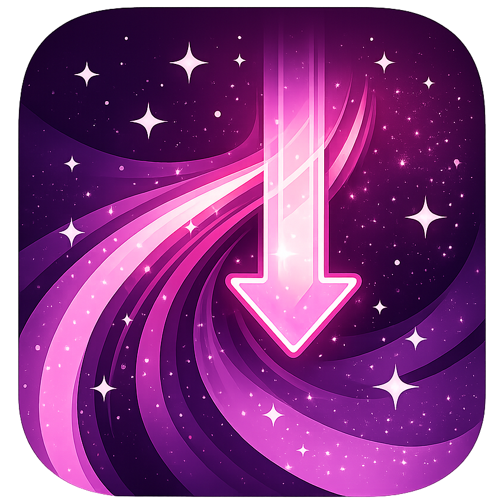

<h1 align="left">
  
  Never Stelle
</h1>

Never Stelle is a self-hosted media downloader with a browser UI for YouTube, Facebook, Instagram, TikTok, Iwara, and other supported sites.

## Features

- Browser-based download queue
- Save directly to storage or download to your device
- Separate default locations for YouTube, Facebook, Instagram, TikTok, Iwara, and Others
- Custom folder and filename templates
- Task states for queued, active, completed, and failed downloads
- Hide completed tasks without deleting the real files
- Delete `.nfo` sidecar files from configured download folders

## Download backends

- `yt-dlp` for general downloads
- `Instaloader` for Instagram downloads
- `iwaradl` for Iwara downloads
- `Flask` for the web application

## Docker Hub image

```text
eaglestelle/never-stelle:latest
```

## Quick start with Docker Hub

Create a `docker-compose.yml` like this:

```yaml
services:
  never-stelle:
    image: eaglestelle/never-stelle:latest
    container_name: never-stelle
    restart: unless-stopped
    environment:
      ACCESSIBLE_VOLUMES_ROOTS: "/library"
      # Optional second download root:
      # ACCESSIBLE_VOLUMES_ROOTS: "/library|/media"
    volumes:
      - ./data:/app/data
      - ./library:/library
      # Optional second download root:
      # - ./media:/media
    ports:
      - "8088:8088"
```

Start it:

```bash
docker compose up -d
```

Open:

```text
http://localhost:8088
```

## Storage and paths

### `/library`

Main download root inside the container.

### `/media`

Optional second download root inside the container.

### `ACCESSIBLE_VOLUMES_ROOTS`

Use `|` to separate allowed container paths.

Example:

```text
/library|/media
```

### Example host mappings

```yaml
environment:
  ACCESSIBLE_VOLUMES_ROOTS: "/library|/media"
volumes:
  - ./data:/app/data
  - /real/path/downloads:/library
  - /real/path/media:/media
```

## Save modes

### Save to NAS

Writes the file into one of the mounted download folders.

### Save to device

Downloads the file server-side first, then sends it back to your browser.

## Data folder

Keep this mounted if you want settings and login state to survive restarts:

```yaml
- ./data:/app/data
```

The `data` folder stores:

- saved settings
- queue state
- task metadata
- Instagram session data
- uploaded Instagram cookies

## Run from source with Python venv

Project root layout:

```text
never-stelle/
├─ README.md
├─ requirements.txt
├─ docker-compose.yml
├─ app/
│  ├─ app.py
│  ├─ templates/
│  └─ static/
├─ data/
├─ library/
└─ tools/
```

### Windows 11

Install these first:

- Python 3.11 or newer
- Git
- Go
- FFmpeg

From the project root:

#### PowerShell

```powershell
py -m venv .venv
.\.venv\Scripts\Activate.ps1
python -m pip install --upgrade pip
pip install -r requirements.txt
```

Create local folders:

```powershell
mkdir data
mkdir library
mkdir tools
```

Build `iwaradl`:

```powershell
git clone https://github.com/Izumiko/iwaradl.git .\tools\iwaradl-src
cd .\tools\iwaradl-src
$env:CGO_ENABLED="0"
go build -o ..\iwaradl\iwaradl.exe .
cd ..\..
```

Test it:

```powershell
.\tools\iwaradl\iwaradl.exe --help
```

Run Never Stelle:

```powershell
cd .\app
$env:APP_DATA_DIR="..\data"
$env:ACCESSIBLE_VOLUMES_ROOTS="..\library"
$env:IWARADL_BIN="..\tools\iwaradl\iwaradl.exe"
python app.py
```

If `ffmpeg.exe` is not on your `PATH`, also set:

```powershell
$env:YTDLP_FFMPEG_LOCATION="C:\full\path\to\ffmpeg.exe"
```

#### Command Prompt

```cmd
py -m venv .venv
.venv\Scripts\activate.bat
python -m pip install --upgrade pip
pip install -r requirements.txt
```

Create local folders:

```cmd
mkdir data
mkdir library
mkdir tools
```

Build `iwaradl`:

```cmd
git clone https://github.com/Izumiko/iwaradl.git .\tools\iwaradl-src
cd .\tools\iwaradl-src
set "CGO_ENABLED=0"
go build -o ..\iwaradl\iwaradl.exe .
cd ..\..
```

Test it:

```cmd
.\tools\iwaradl\iwaradl.exe --help
```

Run Never Stelle:

```cmd
cd app
set "APP_DATA_DIR=..\data"
set "ACCESSIBLE_VOLUMES_ROOTS=..\library"
set "IWARADL_BIN=..\tools\iwaradl\iwaradl.exe"
python app.py
```

If `ffmpeg.exe` is not on your `PATH`, also set:

```cmd
set "YTDLP_FFMPEG_LOCATION=C:\full\path\to\ffmpeg.exe"
```

Open:

```text
http://localhost:8088
```

> Do not copy the terminal prompt itself. Only run the command text.

### Linux

Install these first:

- Python 3.11 or newer
- Python venv support
- Git
- Go
- FFmpeg

On Debian or Ubuntu:

```bash
sudo apt update
sudo apt install -y python3 python3-venv git golang ffmpeg ca-certificates
```

From the project root:

```bash
python3 -m venv .venv
source .venv/bin/activate
python -m pip install --upgrade pip
pip install -r requirements.txt
```

Create local folders:

```bash
mkdir -p data library tools
```

Build `iwaradl`:

```bash
git clone https://github.com/Izumiko/iwaradl.git ./tools/iwaradl-src
cd ./tools/iwaradl-src
CGO_ENABLED=0 go build -o ../iwaradl/iwaradl .
cd ../..
chmod +x ./tools/iwaradl/iwaradl
```

Test it:

```bash
./tools/iwaradl/iwaradl --help
```

Run Never Stelle:

```bash
cd app
export APP_DATA_DIR=../data
export ACCESSIBLE_VOLUMES_ROOTS=../library
export IWARADL_BIN=../tools/iwaradl/iwaradl
python app.py
```

If `ffmpeg` is not on your `PATH`, also set:

```bash
export YTDLP_FFMPEG_LOCATION=/full/path/to/ffmpeg
```

Open:

```text
http://localhost:8088
```

## Troubleshooting

### The container starts but the app is not reachable

```bash
docker compose ps
docker compose logs -f
```

### A download folder does not appear in the app

Check:

- your `volumes:` mappings
- your `ACCESSIBLE_VOLUMES_ROOTS` value

### Instagram downloads fail

Check the Instagram section in Settings:

- Instaloader login
- uploaded cookies for yt-dlp
- saved session state in the `data` folder

### Iwara does not work in a local venv setup

Check:

```bash
iwaradl --help
```

or run the exact binary path you built.

### FFmpeg is not found in a local venv setup

Check:

```bash
ffmpeg -version
```

or set `YTDLP_FFMPEG_LOCATION` to the full path of the binary.

## Credits

Never Stelle uses and builds on top of these projects:

- [Flask](https://flask.palletsprojects.com/) for the web application
- [yt-dlp](https://github.com/yt-dlp/yt-dlp) for supported site downloads
- [Instaloader](https://github.com/instaloader/instaloader) for Instagram support
- [iwaradl](https://github.com/Izumiko/iwaradl) for Iwara support
- [FFmpeg](https://ffmpeg.org/) for media handling where needed

Useful upstream license and project pages:

- [yt-dlp license](https://github.com/yt-dlp/yt-dlp/blob/master/LICENSE)
- [Instaloader license](https://github.com/instaloader/instaloader/blob/master/LICENSE)
- [iwaradl license](https://github.com/Izumiko/iwaradl/blob/master/LICENSE)
- [FFmpeg legal and licensing](https://ffmpeg.org/legal.html)
